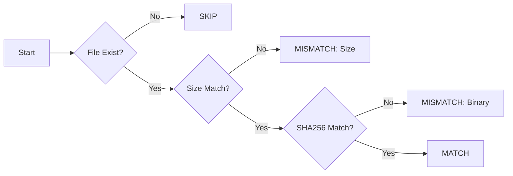

# Binary Image Comparison Tool

画像等バイナリ（.bin）を、ゴールデンデータと厳密に比較するためのコマンドラインツールです。

## 概要

本ツールは、組み込みファームウェア等の開発において、出力されたバイナリファイルが期待値（Golden Data）と完全に一致するかを検証するために作成されました。将来的なデータ領域（画素データ）の特定と部分比較への拡張性を考慮した設計になっています。

## 特徴

* **高速な2段階判定**: まずファイルサイズでフィルタリングし、次にSHA256ハッシュで全体一致を確認します。
* **バイナリセーフ**: 画像のメタデータやフォーマットに依存せず、1ビットの差異も逃さず検出します。
* **ポータビリティ**: Ruby標準ライブラリのみで実装されており、Windows環境でのexe化が容易です。
* **CI/CD対応**: 比較結果（不一致の有無）を終了ステータス（Exit Code）として返すため、自動テストに組み込めます。

## 構成

```text
.
├── comparator.rb        # プログラム本体
├── golden/              # 期待値（正解データ）を配置するディレクトリ
│    ├── sample01.bin
│    └── sample02.bin
├── sample01.bin         # 比較対象（カレントディレクトリに配置）
└── sample02.bin

```

## 使い方

### 実行方法（Ruby）

1. `./golden` ディレクトリを作成し、正解となる `.bin` ファイルを配置します。
2. カレントディレクトリに比較したいファイルを配置します。
3. 以下のコマンドを実行します。
```bash
ruby comparator.rb

```


### Windows用exeの作成

`ocra` を使用して、Rubyがインストールされていない環境向けの実行ファイルを作成できます。

```bash
gem install ocra
ocra comparator.rb --console --no-ruby-archive --add-all-core

```

## 設計仕様

本ツールは**仕様駆動開発（Specification-Driven Development）**に基づいて設計されています。

### 判定フロー



### 拡張性

`BinaryComparator` クラスは、将来的に「特定のオフセットからデータ領域のみを比較する」といったロジックの変更に対して、他のコードに影響を与えず修正できるようカプセル化されています。
