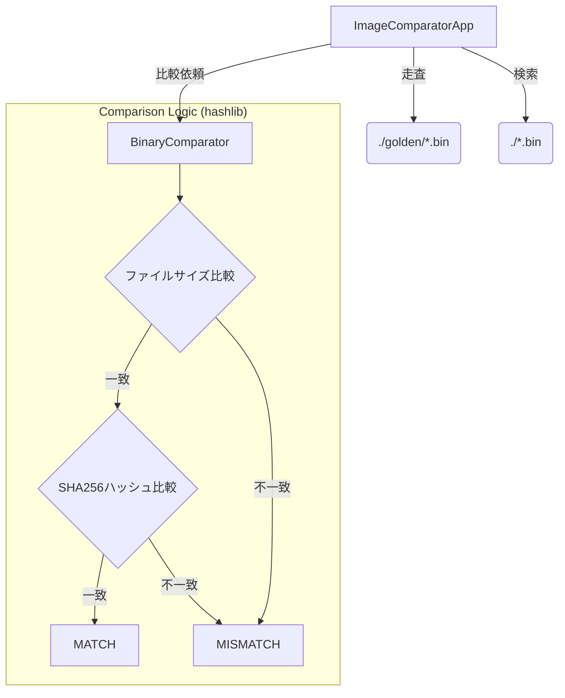
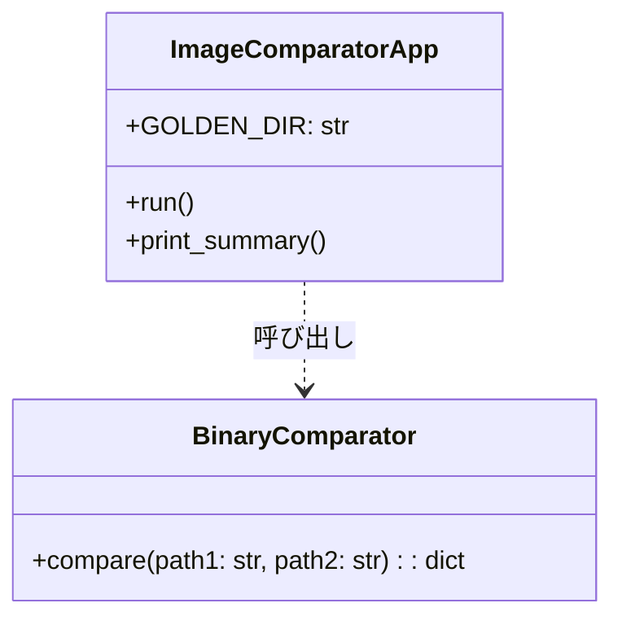

# バイナリ画像比較ツール 設計仕様書 (Python版)

## 1. 概要

本ツールは、組み込みファームウェア内のASICが生成する独自形式（.bin）の画像ファイルを、ゴールデンデータ（期待値）と比較して正当性を検証するためのコマンドラインツールである。Pythonのエコシステムを活用し、Windows環境における単一実行ファイル（exe）としての配布を実現する。

## 2. システム構成・構造

### 2.1 コンポーネント構成

Pythonの標準ライブラリのみを使用し、外部依存を最小限に抑えることで、ビルド時の安定性を担保する。



### 2.2 クラス構造

Ruby版の設計思想を継承し、将来の「データ領域特定」による部分比較への拡張性を維持した構造となっている。



## 3. 動作仕様

### 3.1 入力仕様

* **比較元ディレクトリ:** `./golden/`
* **対象ファイル:** `.bin` 拡張子を持つファイル。
* **カレントディレクトリ:** プログラム実行場所から同名ファイルを自動検索。

### 3.2 判定プロセス

1. **サイズチェック (`os.path.getsize`):** - バイト単位で比較。不一致の場合は即座に不一致と判定。
2. **ハッシュ計算 (`hashlib.sha256`):**
* ストリーム読み込み（チャンク処理）を採用。メモリ消費を抑えつつ、巨大なバイナリファイルも安全に処理する。
* 1ビットの差異も許容しない厳密比較を行う。


### 3.3 出力仕様

* **コンソール表示:**
* `Comparing [ファイル名]... [MATCH / MISMATCH / SKIP]`


* **終了コード:**
* 一つ以上の不一致がある場合は `1`、それ以外は `0`。


* **UX維持機能:**
* exe実行時に結果を確認できるよう、終了前に `input()` による待機処理を行う。


## 4. ビルド・配布仕様

* **実行環境:** Python 3.10以降推奨
* **ビルドツール:** `PyInstaller`
* **ビルドコマンド:**
```bash
pyinstaller --onefile --console comparator.py
```


* **配布形態:** `dist/comparator.exe` の単一ファイル。

## 5. 将来の改良可能性

* **部分比較の導入:** `with open(path, "rb") as f:` に対し `f.seek(offset)` を適用することで、ヘッダを除いたデータ領域のみの比較へ容易に移行可能。
* **並列処理:** 大量のファイルを比較する場合、`concurrent.futures` を用いた並列実行への拡張が可能。
